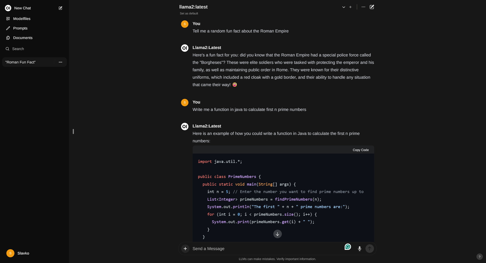

# LLM-Server
Locally hosted OS LLM models
## Endpoints
 - **API**: http://192.168.124.12:11434/api/generate
   - Example: 
       ```
         curl http://192.168.124.12:11434/api/generate -d '{
         "model": "llama2",
         "prompt": "Why is the sky blue?",
         "stream": false
         }'
       ```
   - Additional API Documentation https://github.com/ollama/ollama/blob/main/docs/api.md
 - **UI**: http://192.168.124.12:3000
  

## Server setup & specifications
 - **Hardware requirements**
    - CUDA compatible hardware for hardware acceleration GeForce RTX 1080 TI
    - It can be set up in CPU-only mode, but it is not recommended
 - **Ollama Docker** https://ollama.com/blog/ollama-is-now-available-as-an-official-docker-image
   - GPU mode `docker run -d --gpus=all -v ollama:/root/.ollama -p 11434:11434 --name ollama ollama/ollama`
   - CPU mode `docker run -d -v ollama:/root/.ollama -p 11434:11434 --name ollama ollama/ollama`
   - Run a model like llama2 (optionally) `docker exec -it ollama ollama run llama2`
 - **Open WebUI** https://github.com/open-webui/open-webui
   - `docker run -d -p 3000:8080 --add-host=host.docker.internal:host-gateway -v open-webui:/app/backend/data --name open-webui --restart always ghcr.io/open-webui/open-webui:main`
 - **Watchtower** to keep docker up to date https://containrrr.dev/watchtower/
   - ```
     docker run -d \
      --name watchtower \
      -v /var/run/docker.sock:/var/run/docker.sock \
      containrrr/watchtower
     ```
 - `./scripts/install.sh` to set up the server with no fuss.